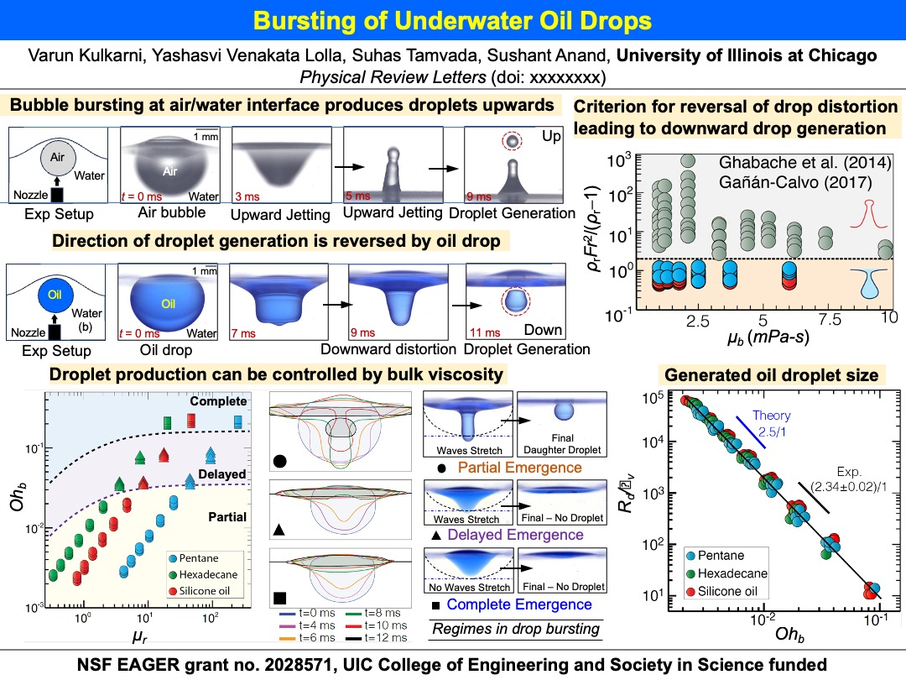

### Project Overview

For decades, researchers have extensively studied two main aspects of underwater oil spills: the ascent of oil droplets and the evolution of the oil slick at the air/water interface. Our research delves into a previously overlooked phenomenon – the bursting of rising oil drops at the air/liquid interface, which occurs prior to the formation of an oil slick.

### Key Findings and Contributions

We discovered a counter-intuitive bulge reversal during the bursting process, which releases a daughter oil droplet back into the bulk liquid, contrasting with the upward-shooting jets typically observed in bursting air bubbles. By unraveling the underlying physics, we demonstrated that the size of the daughter droplets is correlated with the properties of the bulk liquid.

Our findings reveal that the formation of daughter droplets can be suppressed by increasing the bulk viscosity. This insight provides a new understanding of the dynamics involved in underwater oil spills and offers potential strategies for mitigating the environmental impact.

### Research Implications

This research advances our knowledge of oil spill dynamics, highlighting the complex interactions at the air/liquid interface. By understanding these processes, we can develop better methods to predict and control the behavior of oil spills, ultimately aiding in environmental protection and cleanup efforts.

For more details on this project, please view our [publication](https://journals.aps.org/prl/accepted/80073Y9cX9a1ae81e7315fe6165f1f1a011bcf8e8).

---