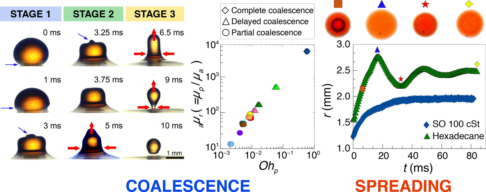

### Project Overview

Oil spills pose a significant threat to marine and ecological environments. One of the challenges in containing oil spills is the behavior of small oil droplets merging with larger bodies of water. Our research focuses on understanding the inter-connectivity and physical properties of these droplets, particularly their pinch-off behavior and the scaling laws governing three-phase systems.

### Hypothesis

We hypothesized that the mitigation of oil spills is closely linked to the coalescence-dependent spreading of oil droplets. This inter-connectivity, influenced by the physical properties of the droplets, has not been thoroughly explored until now. Additionally, the pinch-off behavior and scaling laws for such systems have not been previously reported.

### Experiments

To investigate this, we conducted methodical studies on 11 different n-alkanes, polymers, and hydrocarbons with varying viscosities and initial spreading coefficients. By gently depositing a single drop of oil on a pool of water, we aimed to simulate an oil spill scenario. Our experiments focused on creating a regime map, and establishing scaling laws for deformation features and spreading behavior.

### Key Findings

Our research uncovered a previously undocumented regime of delayed coalescence. We applied a novel inertia-visco-capillary (I-V-C) scale to collapse all experimental coalescence data onto a single line. We observed that early-stage spreading of oil droplets can be either oscillatory or asymptotically reach a constant value, depending on the viscosity of the oil. This is in contrast to the well-documented monotonic, power-law late-time spreading behavior. These findings have broad applications, including emulsions and enhanced oil recovery.

{: .responsive-image }

The image above provides a visual summary of our findings, showing the stages of coalescence, regime mapping, and spreading behavior of oil droplets in various conditions. 

### Conclusion

This project advances our understanding of underwater oil spill dynamics and offers potential strategies for mitigating their environmental impact. Our findings contribute valuable insights into the physics of oil droplet behavior and provide a foundation for future research and practical applications.

For more details, please refer to our publication in [Journal of Colloid and Interfacial Science](https://doi.org/10.1016/j.jcis.2020.10.089).