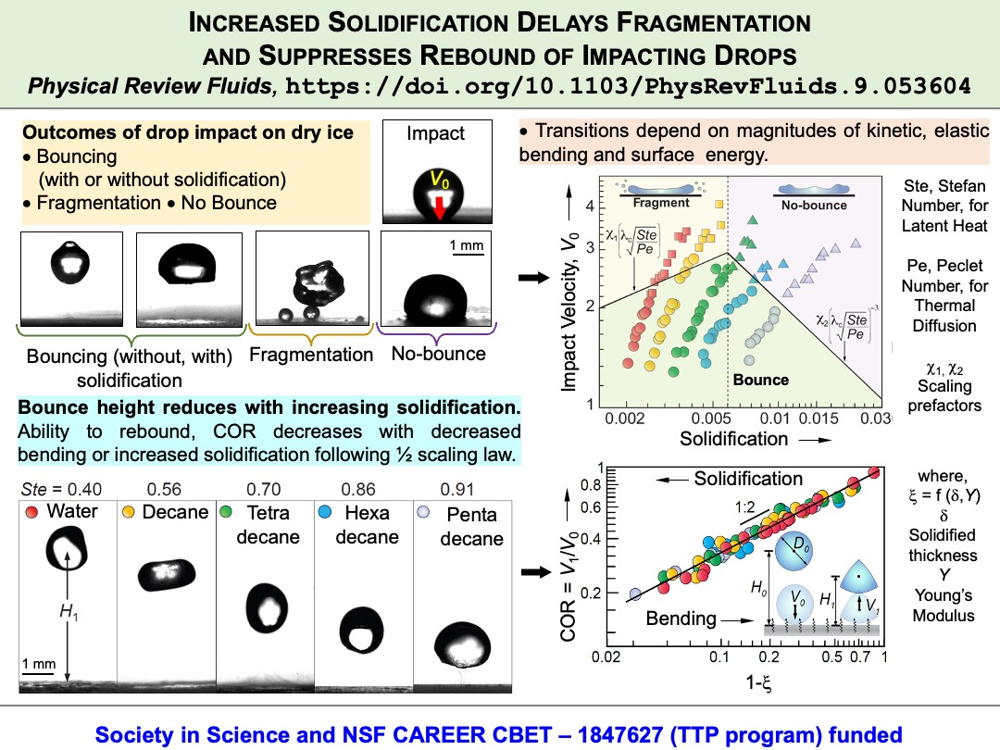

### Project Overview

This project investigates the behavior of liquid drops impacting supercooled sublimating surfaces, such as dry ice. Unlike supercooled solid surfaces where splats formed after drop impact tend to stick, sublimating surfaces inhibit pinning and promote efficient rebound of the drops. Our research focuses on understanding how solidification within the drops influences the outcomes of their impact on these ultralow adhesive surfaces.

### Key Findings

Our findings reveal that the extent of solidification inside the drops plays a crucial role in determining whether rebound can be suppressed or fragmentation can be controlled. We show that the solidification thickness, which depends on the impact velocity, is the primary factor in suppressing rebound and delaying fragmentation. This results in a broad spectrum of outcomes from complete bouncing to no rebound, which is not observed in impacts on supercooled superhydrophobic surfaces.

### Detailed Insights

- **Impact Velocity and Solidification**: At lower impact velocities, drops tend to rebound efficiently on dry ice. However, at higher impact velocities, the drop fragments and leaves behind a trail of smaller droplets. The extent of solidification within the drop, influenced by the impact velocity, drives these different outcomes.
- **Thermo-Elastocapillarity**: We attribute the varied impact outcomes to thermo-elastocapillarity, which considers the bending of the solidified layer within the drop. This concept helps demarcate regime boundaries and determine the coefficient of restitution during rebound.

### Conclusion

Our research highlights the unique behaviors of drops impacting sublimating supercooled surfaces, presenting a range of outcomes from complete bouncing to no rebound. These findings offer new insights into the physics of drop impacts and can inform the design of surfaces with tailored adhesive properties for various applications.

For more details on this project, please refer to our publication in [Physical Review Fluids](https://doi.org/10.1103/PhysRevFluids.9.053604)

{: .responsive-image }